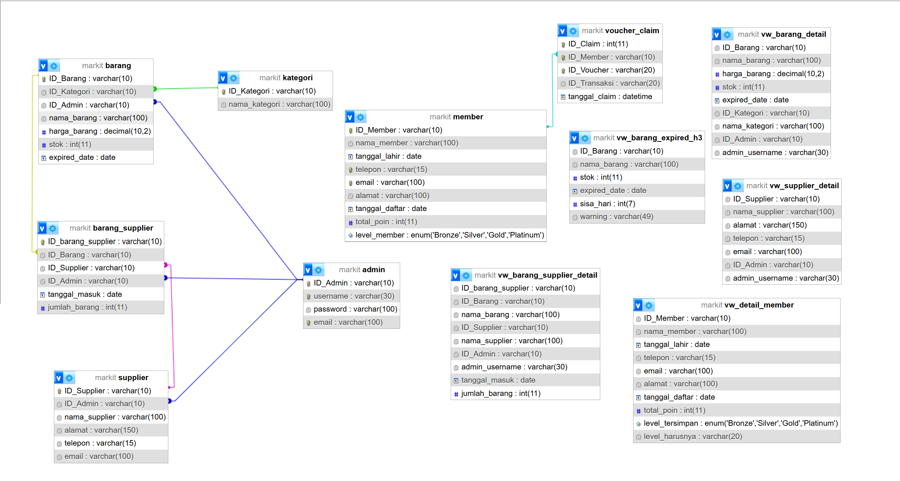

# SIMPLE REPORT FINAL PROJECT - SISTEM BASIS DATA

## Minimarket Teknologi Informasi (MarkIT)

**Mata Kuliah:** Sistem Basis Data (SBD) - Kelas B

**Dosen Pengampu:** Rizka Wakhidatus Sholikah

**Kelompok 5:**

| No | Nama | NRP |
|----|------|-----|
| 1 | Ferlin Erdina Sari | 5027251002 |
| 2 | Silfi Rochmatul Auliyah | 5027251008 |
| 3 | Nazwa Aulia Dwi Putri | 5027251018 |
| 4 | Nayla Aisha Hanifa | 5027251075 |

---

## BAB 1 - PENDAHULUAN

### 1.1 Latar Belakang

Departemen Teknologi Informasi ITS yang berlokasi di Lantai 7 Tower 2 ITS saat ini belum memiliki fasilitas minimarket di area departemen yang dapat memenuhi kebutuhan makanan ringan dan minuman bagi mahasiswa maupun dosen. Ketika mahasiswa memiliki jeda antar mata kuliah atau membutuhkan makanan dan minuman, mereka harus pergi ke kantin yang berada di area lain di lingkungan ITS. Jarak yang cukup jauh dari lantai 7 menuju kantin menyebabkan waktu istirahat menjadi kurang efektif dan dapat mengurangi waktu belajar maupun persiapan perkuliahan berikutnya.

Oleh karena itu, kelompok kami mengusulkan **MarkIT** (*Minimarket Teknologi Informasi*), yaitu minimarket sederhana Departemen Teknologi Informasi yang menyediakan makanan ringan dan minuman serta didukung oleh **sistem informasi berbasis database hybrid (MySQL + MongoDB)** untuk mengelola barang, stok, transaksi penjualan, membership, voucher, dan ulasan produk.

### 1.2 Identifikasi Masalah

1. Tidak tersedia minimarket di area Departemen Teknologi Informasi
2. Jarak ke kantin relatif jauh dari lantai 7
3. Waktu istirahat menjadi kurang efektif
4. Potensi antrian pada jam istirahat
5. Belum ada sistem pengelolaan jika minimarket dibangun

### 1.3 Tujuan

**Tujuan Bisnis:**
- Menyediakan akses makanan dan minuman yang lebih dekat bagi mahasiswa dan dosen Departemen Teknologi Informasi
- Mengurangi waktu yang dibutuhkan untuk mencari makanan saat jeda perkuliahan
- Meningkatkan kenyamanan civitas akademika

**Tujuan Sistem:**
- Mengelola data barang yang dijual
- Mengelola stok barang secara terpusat
- Mencatat transaksi penjualan
- Membantu pembuatan laporan penjualan dan stok
- Mengurangi kesalahan pencatatan manual

---

## BAB 2 - FUNGSIONALITAS SISTEM

### 2.1 Fitur Utama MarkIT

| No | Fitur | Deskripsi | Database |
|----|-------|-----------|----------|
| 1 | Manajemen Stok & Supplier | Mengelola data barang (tambah, ubah, hapus), kategori, harga, dan melacak stok secara real-time. Mencatat data supplier serta riwayat pasokan barang masuk. | MySQL |
| 2 | Fitur Membership | Mengelola pendaftaran dan data profil pelanggan tetap (Member). Melacak akumulasi poin belanja dan tingkat keanggotaan (Bronze → Silver → Gold → Platinum). | MySQL |
| 3 | Riwayat Transaksi | Mencatat seluruh dokumentasi struk belanja konsumen. Menggunakan teknik *embedding* (array item belanja dalam satu dokumen transaksi). | MongoDB |
| 4 | Manajemen Promo/Voucher | Menyusun, menyimpan, dan mengaktifkan berbagai skema diskon atau voucher belanja. Skema fleksibel MongoDB mempermudah perubahan aturan. | MongoDB |
| 5 | Fitur Rating/Ulasan | Menampung feedback, ulasan teks bebas, dan rating bintang (1-5) dari pelanggan terhadap produk yang dibeli. | MongoDB |

### 2.2 Alasan Pemisahan Database (Hybrid Architecture)

**MySQL (Relational Database)** digunakan untuk data yang:
- Memiliki struktur tetap dan relasi antar entitas yang kuat
- Membutuhkan integritas referensial (foreign key)
- Contoh: Admin, Barang, Kategori, Supplier, Barang_Supplier, Member, Voucher_Claim

**MongoDB (Non-Relational Database)** digunakan untuk data yang:
- Memiliki struktur fleksibel/dinamis
- Membutuhkan embedded documents (nested array)
- Contoh: Transaksi (dengan embedded `daftar_barang`), Voucher, Ulasan

---

## BAB 3 - DESAIN DATABASE

### 3.1 Identifikasi Entitas

| Entitas | Deskripsi |
|---------|-----------|
| Admin | Pengelola sistem MarkIT |
| Barang | Produk yang dijual di MarkIT |
| Kategori | Pengelompokan barang berdasarkan jenisnya |
| Supplier | Pemasok barang ke MarkIT |
| Barang_Supplier | Riwayat restock barang dari supplier (junction table) |
| Member | Pelanggan terdaftar dalam program membership |
| Voucher_Claim | Riwayat penggunaan voucher oleh member (junction table) |
| Transaksi | Data transaksi pembelian (MongoDB) |
| Voucher | Informasi promo/diskon yang tersedia (MongoDB) |
| Ulasan | Penilaian dan komentar pelanggan terhadap produk (MongoDB) |

### 3.2 Relasi Antar Entitas

| Relasi | Tipe | Keterangan |
|--------|------|------------|
| Kategori → Barang | One to Many | Satu kategori memiliki banyak barang |
| Admin → Barang | One to Many | Satu admin mengelola banyak barang |
| Admin → Supplier | One to Many | Satu admin mengelola banyak supplier |
| Barang ↔ Supplier | Many to Many | Melalui junction table `Barang_Supplier` |
| Barang → Barang_Supplier | One to Many | Satu barang bisa memiliki banyak record suplai |
| Supplier → Barang_Supplier | One to Many | Satu supplier bisa memiliki banyak record suplai |
| Barang → Ulasan | One to Many | Satu barang bisa punya banyak ulasan |
| Member → Transaksi | One to Many | Satu member bisa melakukan banyak transaksi |
| Member ↔ Voucher | Many to Many | Melalui junction table `Voucher_Claim` |
| Voucher → Transaksi | One to Many | Satu voucher bisa dipakai di banyak transaksi |



### 3.3 Desain Tabel MySQL

#### Tabel `admin`
| Kolom | Tipe Data | Constraint |
|-------|-----------|------------|
| ID_Admin | VARCHAR(10) | PRIMARY KEY |
| username | VARCHAR(30) | UNIQUE, NOT NULL |
| password | VARCHAR(100) | NOT NULL |
| email | VARCHAR(100) | UNIQUE, NOT NULL |

**Data:** 2 admin — `ADM-001` (admin_dry) mengelola barang kering, `ADM-002` (admin_fresh) mengelola barang segar/dingin.

#### Tabel `kategori`
| Kolom | Tipe Data | Constraint |
|-------|-----------|------------|
| ID_Kategori | VARCHAR(10) | PRIMARY KEY |
| nama_kategori | VARCHAR(100) | NOT NULL |

**Data:** 13 kategori — Minuman Kaleng, Minuman Dingin, Makanan Ringan, Makanan Berat, Roti & Kue, Permen & Cokelat, Es Krim, Kopi & Teh Instan, Alat Tulis Kampus, Obat & Suplemen, Perawatan Diri, Mie Instan, Susu & Olahannya.

#### Tabel `barang`
| Kolom | Tipe Data | Constraint |
|-------|-----------|------------|
| ID_Barang | VARCHAR(10) | PRIMARY KEY |
| ID_Kategori | VARCHAR(10) | FK → kategori |
| ID_Admin | VARCHAR(10) | FK → admin |
| nama_barang | VARCHAR(100) | NOT NULL |
| harga_barang | DECIMAL(10,2) | NOT NULL |
| stok | INT | NOT NULL |
| expired_date | DATE | NULLABLE |

**Data:** 46 produk dari 13 kategori berbeda.

#### Tabel `supplier`
| Kolom | Tipe Data | Constraint |
|-------|-----------|------------|
| ID_Supplier | VARCHAR(10) | PRIMARY KEY |
| ID_Admin | VARCHAR(10) | FK → admin |
| nama_supplier | VARCHAR(100) | |
| alamat | VARCHAR(150) | |
| telepon | VARCHAR(15) | |
| email | VARCHAR(100) | |

**Data:** 10 supplier dari berbagai kota di Jawa Timur.

#### Tabel `barang_supplier`
| Kolom | Tipe Data | Constraint |
|-------|-----------|------------|
| ID_barang_supplier | VARCHAR(10) | PRIMARY KEY |
| ID_Barang | VARCHAR(10) | FK → barang |
| ID_Supplier | VARCHAR(10) | FK → supplier |
| ID_Admin | VARCHAR(10) | FK → admin |
| tanggal_masuk | DATE | |
| jumlah_barang | INT | |

**Data:** 45 record restock barang.

#### Tabel `member`
| Kolom | Tipe Data | Constraint |
|-------|-----------|------------|
| ID_Member | VARCHAR(10) | PRIMARY KEY |
| nama_member | VARCHAR(100) | NOT NULL |
| tanggal_lahir | DATE | NOT NULL |
| telepon | VARCHAR(15) | UNIQUE, NOT NULL |
| email | VARCHAR(100) | UNIQUE, NOT NULL |
| alamat | VARCHAR(100) | NOT NULL |
| tanggal_daftar | DATE | NOT NULL |
| total_poin | INT | DEFAULT 0 |
| level_member | ENUM('Bronze','Silver','Gold','Platinum') | |

**Data:** 15 member dengan level Bronze hingga Platinum.

#### Tabel `voucher_claim`
| Kolom | Tipe Data | Constraint |
|-------|-----------|------------|
| ID_Claim | INT | PRIMARY KEY, AUTO_INCREMENT |
| ID_Member | VARCHAR(10) | FK → member, UNIQUE(ID_Member, ID_Voucher) |
| ID_Voucher | VARCHAR(20) | |
| ID_Transaksi | VARCHAR(20) | |
| tanggal_claim | DATETIME | DEFAULT CURRENT_TIMESTAMP |

### 3.4 Desain Koleksi MongoDB

#### Collection `transaksi`
```json
{
  "invoice_id": "INV-0001",       
  "id_member": "MBR-0001",   
  "id_voucher": "VOC-0005",      
  "id_admin": "ADM-002",    
  "tanggal_transaksi": ISODate(),
  "total_harga_before_voucher": 139500,
  "total_harga_after_voucher": 118575,
  "daftar_barang": [            
    {
      "id_barang": "001-00001",
      "jumlah": 2,
      "harga": 8500
    }
  ],
  "metode_pembayaran": "QRIS"
}
```
> **Teknik: Embedding** — `daftar_barang` disimpan langsung di dalam dokumen transaksi untuk efisiensi query (tidak perlu join).

**Data:** 27 transaksi dengan berbagai metode pembayaran (Cash, QRIS, Debit, E-Wallet).

#### Collection `voucher`
```json
{
  "ID_Voucher": "VOC-0001",
  "ID_Admin": "ADM-001",
  "kode_voucher": "NEW50",
  "nama_voucher": "Welcome Member",
  "jenis_voucher": "Diskon New Member",
  "nilai_diskon": 50,
  "minimal_belanja": 0,
  "tanggal_mulai": ISODate(),
  "tanggal_berakhir": ISODate(),
  "syarat_level": "Member Baru",
  "status_voucher": "Aktif"
}
```
**Data:** 6 voucher utama + voucher testing.

| Kode | Nama | Diskon | Syarat Level |
|------|------|--------|-------------|
| NEW50 | Welcome Member | 50% | Member Baru |
| BRZ10 | Bronze Rewards | 2% | Bronze |
| SLV15 | Silver Rewards | 5% | Silver |
| GLD25 | Gold Rewards | 10% | Gold |
| PLT50 | Platinum Exclusive | 15% | Platinum |
| BDAY20 | Birthday Special | 20% | Semua Member |

#### Collection `ulasan`
```json
{
  "_id": "ULS-0001",
  "id_barang": "001-00001",
  "rating": 5,
  "komentar": "Milo paling top pokoknya selalu enak.",
  "tanggal_ulasan": ISODate()
}
```
**Data:** 11 ulasan dengan rating 1-5.

---

## BAB 4 — IMPLEMENTASI DATABASE LANJUTAN (MySQL)

### 4.1 Function

#### `fn_level_member(p_total_poin)`
Menentukan level member berdasarkan total poin secara otomatis.

```sql
FUNCTION fn_level_member(p_total_poin INT) RETURNS VARCHAR(20)
BEGIN
    IF p_total_poin >= 1000 THEN RETURN 'Platinum';
    ELSEIF p_total_poin >= 500 THEN RETURN 'Gold';
    ELSEIF p_total_poin >= 200 THEN RETURN 'Silver';
    ELSE RETURN 'Bronze';
    END IF;
END
```

| Total Poin | Level |
|-----------|-------|
| ≥ 1000 | Platinum |
| ≥ 500 | Gold |
| ≥ 200 | Silver |
| < 200 | Bronze |

### 4.2 Triggers

| Trigger | Event | Fungsi |
|---------|-------|--------|
| `trg_barang_stok_tidak_negatif_insert` | BEFORE INSERT on `barang` | Mencegah stok negatif saat insert barang baru |
| `trg_barang_stok_tidak_negatif_update` | BEFORE UPDATE on `barang` | Mencegah stok negatif saat update stok (misal setelah transaksi) |
| `trg_member_set_level_before_insert` | BEFORE INSERT on `member` | Otomatis set level member berdasarkan poin saat registrasi |
| `trg_member_set_level_before_update` | BEFORE UPDATE on `member` | Otomatis update level member saat poin berubah |

**Contoh trigger stok negatif:**
```sql
TRIGGER trg_barang_stok_tidak_negatif_update BEFORE UPDATE ON barang
FOR EACH ROW
BEGIN
    IF NEW.stok < 0 THEN
        SIGNAL SQLSTATE '45000'
        SET MESSAGE_TEXT = 'Stok barang tidak boleh negatif';
    END IF;
END
```

### 4.3 Stored Procedures

| Procedure | Parameter | Fungsi |
|-----------|-----------|--------|
| `sp_cek_warning_expired` | p_id_barang | Mengecek apakah barang mendekati kadaluarsa (≤ 3 hari) |
| `sp_claim_voucher` | p_id_member, p_id_voucher, p_id_transaksi | Klaim voucher oleh member (validasi: hanya member, tidak boleh duplikat) |
| `sp_member_per_level` | p_level | Menampilkan daftar member berdasarkan level tertentu |
| `sp_tambah_poin_member` | p_id_member, p_total_bayar | Menambahkan poin member (setiap Rp1.000 = 10 poin) |
| `sp_update_level_member` | p_id_member | Update level satu member berdasarkan poin |
| `sp_update_semua_level_member` | — | Update level semua member sekaligus |
| `sp_proses_transaksi_mysql` | p_id_transaksi, p_id_member, p_id_voucher, p_total, p_daftar | Proses transaksi lengkap (kurangi stok, tambah poin, klaim voucher) |
| `sp_sesuaikan_admin_barang` | — | Assign admin ke barang berdasarkan kategori |
| `sp_sesuaikan_admin_supplier` | — | Assign admin ke supplier berdasarkan ID |

### 4.4 Views

| View | Fungsi |
|------|--------|
| `vw_barang_detail` | Menampilkan detail barang lengkap dengan nama kategori dan username admin (JOIN barang + kategori + admin) |
| `vw_barang_expired_h3` | Menampilkan barang yang akan expired dalam 3 hari ke depan beserta warning |
| `vw_barang_supplier_detail` | Menampilkan detail restock barang lengkap dengan nama barang, supplier, dan admin |
| `vw_detail_member` | Menampilkan detail member dengan perbandingan level tersimpan vs level seharusnya (menggunakan `fn_level_member`) |
| `vw_supplier_detail` | Menampilkan detail supplier lengkap dengan username admin yang mengelola |

---

## BAB 5 - ARSITEKTUR BACKEND

### 5.1 Teknologi yang Digunakan

| Komponen | Teknologi |
|----------|-----------|
| Runtime | Node.js |
| Framework | Express.js |
| MySQL Driver | mysql2 |
| MongoDB ODM | Mongoose |
| Dev Tool | Nodemon |
| API Testing | Postman |

### 5.2 Struktur Project

```
markit-backend/
├── config/
│   ├── models/
│   │   ├── Transaksi.js      
│   │   ├── Ulasan.js          
│   │   └── Voucher.js         
│   ├── mongodb.js           
│   └── mysql.js    
├── routes/
│   ├── barangDetailRoutes.js  
│   ├── barangRoutes.js        
│   ├── barangSupplierRoutes.js
│   ├── kategoriRoutes.js  
│   ├── memberRoutes.js  
│   ├── supplierRoutes.js
│   ├── transaksiRoutes.js
│   ├── ulasanRoutes.js 
│   └── voucherRoutes.js 
├── server.js 
├── package.json
├── testMongo.js 
└── .env 
```

### 5.3 API Endpoints

#### MySQL Routes
| Method | Endpoint | Deskripsi |
|--------|----------|-----------|
| GET | `/api/member` | Ambil semua data member |
| GET | `/api/barang` | Ambil semua data barang |
| GET | `/api/kategori` | Ambil semua data kategori |
| GET | `/api/supplier` | Ambil semua data supplier |
| GET | `/api/barang-supplier` | Ambil semua data restock barang |
| GET | `/api/barang-detail` | Ambil detail barang (JOIN kategori + admin) |

#### MongoDB Routes — Transaksi
| Method | Endpoint | Deskripsi |
|--------|----------|-----------|
| GET | `/api/transaksi` | Ambil semua transaksi |
| GET | `/api/transaksi/:id` | Detail transaksi by invoice_id |
| POST | `/api/transaksi` | Buat transaksi baru (hybrid MySQL+MongoDB) |
| DELETE | `/api/transaksi/:id` | Hapus transaksi |

#### MongoDB Routes — Voucher
| Method | Endpoint | Deskripsi |
|--------|----------|-----------|
| GET | `/api/voucher` | Ambil semua voucher |
| GET | `/api/voucher/:id` | Detail voucher by ID_Voucher |
| POST | `/api/voucher` | Tambah voucher baru |
| PUT | `/api/voucher/:id` | Update voucher |
| DELETE | `/api/voucher/:id` | Hapus voucher |

#### MongoDB Routes — Ulasan
| Method | Endpoint | Deskripsi |
|--------|----------|-----------|
| GET | `/api/ulasan` | Ambil semua ulasan |
| GET | `/api/ulasan/:id` | Detail ulasan by _id |
| POST | `/api/ulasan` | Tambah ulasan baru |
| PUT | `/api/ulasan/:id` | Update ulasan |
| DELETE | `/api/ulasan/:id` | Hapus ulasan |

### 5.4 Alur Transaksi (Fitur Unggulan)

Fitur POST transaksi merupakan fitur paling kompleks karena menggabungkan **MySQL dan MongoDB** dalam satu alur:

```
1. Validasi input (id_admin, metode_pembayaran, daftar_barang)
2. Loop setiap barang → Cek stok di MySQL (SELECT dari tabel Barang)
3. Hitung total harga sebelum voucher
4. Jika ada voucher → Ambil data voucher dari MongoDB → Hitung diskon
5. Generate invoice_id (INV-XXXX) dari data terakhir di MongoDB
6. Simpan dokumen transaksi ke MongoDB (dengan embedded daftar_barang)
7. Update stok barang di MySQL (UPDATE stok = stok - jumlah)
8. Return response lengkap dengan detail transaksi
```

> **Anti Double-Click:** Sistem menggunakan `Map` untuk mencegah request ganda dalam waktu bersamaan.

---

## BAB 6 - KESIMPULAN

Proyek MarkIT berhasil mengimplementasikan sistem database hybrid yang menggabungkan kekuatan **MySQL** (untuk data terstruktur dengan relasi kuat) dan **MongoDB** (untuk data fleksibel dengan embedded documents). Sistem ini mencakup:

1. **6 tabel MySQL** dengan foreign key constraints yang menjaga integritas data
2. **3 koleksi MongoDB** dengan teknik embedding untuk efisiensi query
3. **1 function** untuk kalkulasi level member otomatis
4. **4 trigger** untuk validasi stok dan auto-update level
5. **9 stored procedure** untuk business logic yang kompleks
6. **5 view** untuk mempermudah query reporting
7. **Backend Node.js** dengan 15+ API endpoint yang terintegrasi via Postman
